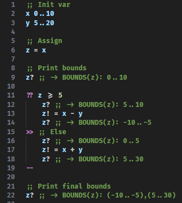

# BDSL - Bounded Data Simple Language

This is a very simple programming language, aiming to provide guarantees on variables bounds.

## Gist

The idea behind this language is to be able to define bounds for each variable,
and to carry those bounds along with each operation.

The sole purpose of this is because yes, and I am developing this just for fun.

### What does the code look like



## How to run code

You can simply type:
```
python bdsl.py <filename>
```
or simply
```
python bdsl.py <example #>
```
to run example number # from the [examples/](examples/) folder.

## Supported features

List of features that are supported and that are not (yet)

- [x] Assignment
- [x] Simple operations between variables (+,-,*,/)
- [x] Control flow statement
  - [x] `if` with one condition
  - [ ] `if` with multiple conditions
  - [x] `else`
  - [ ] `elseif`
- [ ] While loop
- [ ] For loop
- [ ] Jumps (?)
- [ ] Strings
- [ ] Functions
- [ ] Being self hosted
  - This is extremely long term, since before this I need to figure out what this language could actually be used for.
  
## Syntax

### Comments
```
;; This is a simple comment
```
`;; ` mark the beginning of a line comment (block comments are not supported atm, maybe in the future).

### Definition
```
x L..U
```
define the `x` variable to be in range [`L`,`U`].

### Assignment
```
y = x
```
Assigns `y` to have the same range as `x`.

It is important to notice that variables are not mutable.
therefore, to force them to change, the exclamation mark `!` need to be suffixed to the variable, like so:
```
y! = x
```

### Bounds check/display
```
x?
```
suffixing a variable with a question mark `?`, prints to the console its bound at that point in time.

### If/else

```
?? x > 10
    ;; ...
>>
    ;; ...
--
```
`??` is the equivalent of the `if` keyword.
Then, `>>` is else, and `--` is `end`.

I chose this just for fun, trying to find a syntax that could be
both fun, pretty, a bit different, but still usable.

